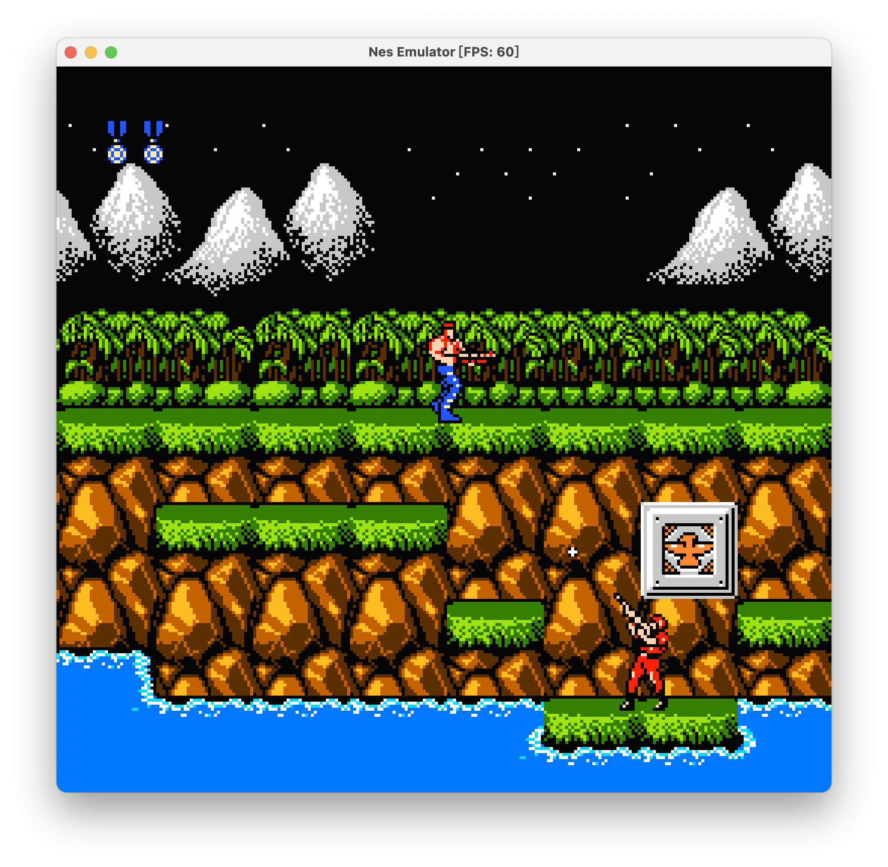

# NesEmulator

This is a NES emulator. It implements Mapper0-4, which cover about 80% of iNes rom. The following games have been
tested, other games may or may not work:

- Super Mario Bros.
- Battle City
- Contra
- Teenage Mutant Ninja Turtles
- Double Dragon
- Zelda

## Screenshots

## Usage

~~~bash
./NesEmulator <nes file path>
~~~

### Controller

#### Player1

| Button | Mapped to |
|:------:|:---------:|
|   A    |     J     |
|   B    |     K     |
| Select |   Space   |
| Start  |   Enter   |
|   Up   |     W     |
|  Down  |     S     |
|  Left  |     A     |
| Right  |     D     |

#### Quick Save

| Button | Effect  |
|:------:|:-------:|
|   L    |  Save   |
|   I    | Restore |

## How to build

### Prerequisites

- A compiler supporting C++20.
- Python3 installed.
- CMake installed.

### Building with Conan Package Manager

1. Install Conan

    ~~~bash
    pip install conan -U
    ~~~

2. Clone and Build

    ~~~bash
    git clone https://github.com/ocfbnj/NesEmulator.git
    cd NesEmulator
    mkdir build
    cd build
    cmake .. -DCMAKE_BUILD_TYPE=Release
    cmake --build .
    ~~~

Now, you can find the binary in `build/src` directory.

## References

### Nesdev Wiki

- <https://wiki.nesdev.org>

### Tutorials

- <https://bugzmanov.github.io/nes_ebook>
- <https://www.youtube.com/playlist?list=PLrOv9FMX8xJHqMvSGB_9G9nZZ_4IgteYf>
- <https://www.jianshu.com/u/daef9bb95a24>

### Other NES implementations

- <https://github.com/bugzmanov/rustness_monster>
- <https://github.com/fogleman/nes>
- <https://github.com/OneLoneCoder/olcNES>
- <https://github.com/amhndu/SimpleNES>

### CPU

- <https://skilldrick.github.io/easy6502>
- <https://www.masswerk.at/6502/6502_instruction_set.html>
- <http://obelisk.me.uk/6502/> (This page was closed.)

### Graphic

- <https://github.com/OneLoneCoder/olcPixelGameEngine>
